# Using Git with Windows PowerShell

How to install Git on Windows 10 systems and run Git from a PowerShell command line.

## Installing Git

On modern Windows systems, the best way to get Git is to use the installers produced by the _[Git for Windows project][gfw-project]_.

Download the install kit from [https://git-for-windows.github.io/][gfw-home]. This will download the installer for the latest release, and that will install 64-bit software. If you want 32-bit software, or a specific git-for-windows version, then visit the [release section][gfw-releases] of the [git-for-windows project][gfw-project]: [https://github.com/git-for-windows/git/releases][gfw-releases].

[gfw-home]: https://git-for-windows.github.io/
[gfw-releases]: (https://github.com/git-for-windows/git/releases)
[gfw-project]: https://github.com/git-for-windows/git

Launch the installer as the administrator[^runas] and walk through the installation[^watv] dialog as follows:

[^runas]: Right click on the file and select "Run as administrator". Or open a command using using "Run as administrator" and run the installer EXE from that command line.

[^watv]: I downloaded the 2.7.0 installer, Git-2.7.0.2-64-bit.exe, and ran it (as administrator) on my Windows 10 box.

1. First window. Next.

    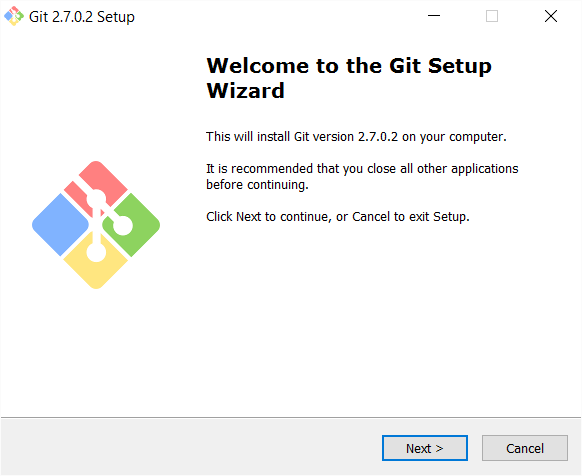

2. License window. Next.

    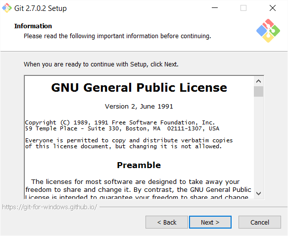

3. Install path. If this isn't installing in `Program Files` then you probably didn't run the installer with elevated privilege[^runas]. Next.

    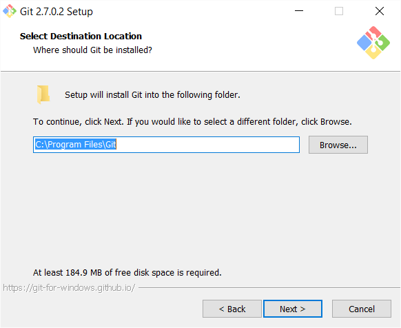

4. Select options to be installed. Because the goal is to minimize the impact on the Windows system, and to run Git from a PowerShell command line, I recommend unchecking all the options.

    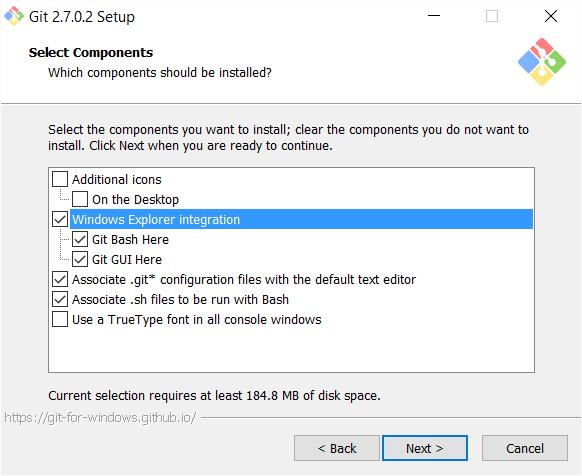

    Uncheck everything. Next.

    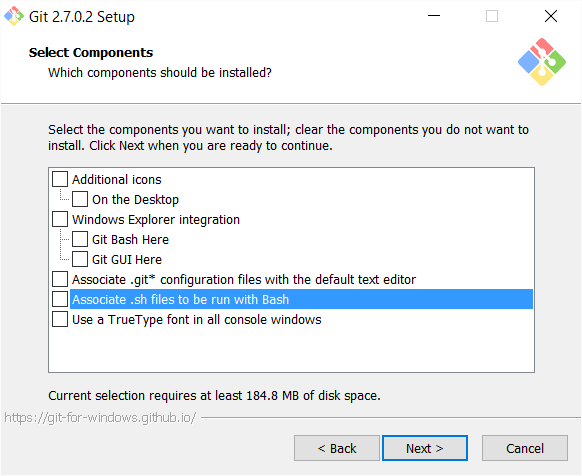

5. Start panel folder name. Next.

    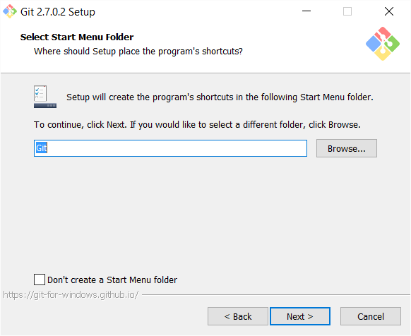

6. Adjusting the PATH. Leave the default option, the one that does _not_ modify the path. Next.

    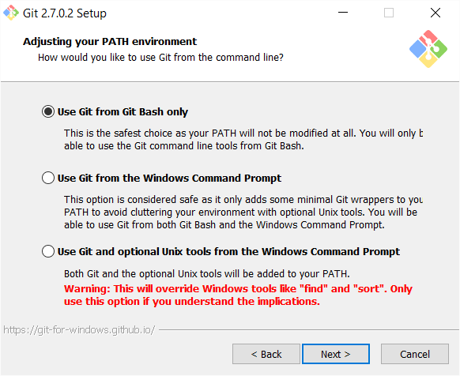

7. Line ending conversion. Leave the default option, the one that checks out Windows-style line endings and commits Unix-style line endings.

    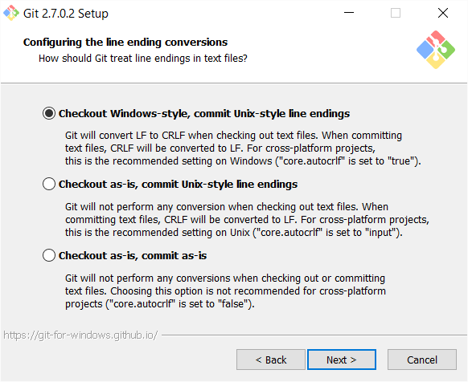

8. Select the terminal emulator. On a Windows 8.1 (or Server 2012 R2) or earlier system, leave the default selection (MinTTY).

    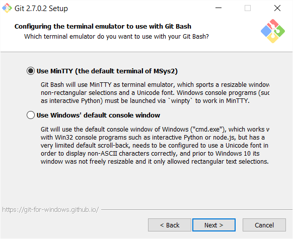

    On a Windows 10 system, change to use the Windows' default console window.

    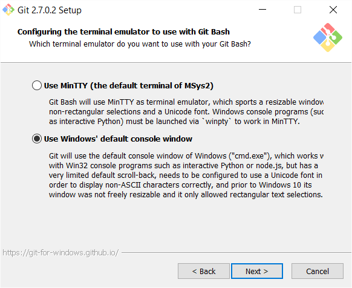

9. Performance tweaks. Don't select anything. Next.

    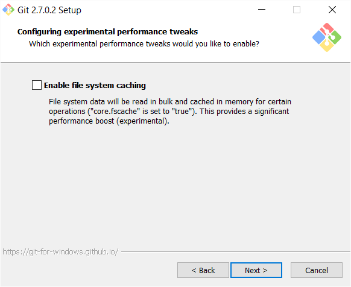

10. Watch the install proceed.

    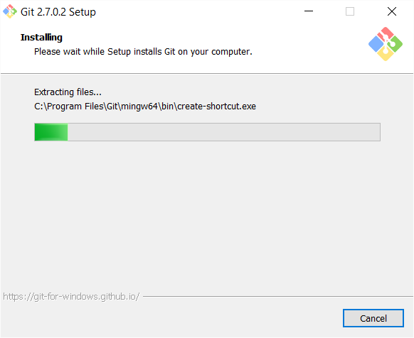

11. Install completed. Click Finish and read the release notes. Really. Especially the known issues section.

    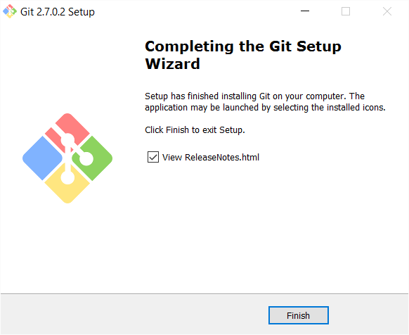

The installer will have laid down three shortcuts in the start menu.

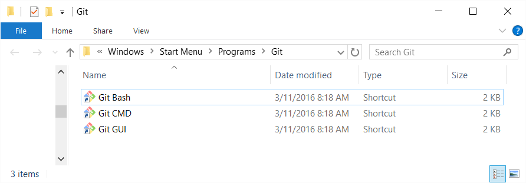

My goal is to not use any of them. I want to use Git from a PowerShell command line. However, if you want to use either `Git Bash` or `Git CMD` then you should launch each[^priv] and configure the window properties to enable Quick Edit and set the scroll buffer to 9999 lines.

[^priv]: You may need to launch the command windows using "Run as administrator" to have the privileges needed to save the window property changes.

 --> 

 --> 


It's worth launching a command window and checking to see that the expected version of Git is installed and running.

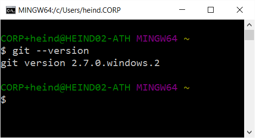

## Configure a simple Git PowerShell command window

Use the file explorer to navigate to `:\Windows\System32\WindowsPowerShell\v1.0` and right-click on `powershell.exe` to create a shortcut on the desktop. Rename that shortcut to "Windows PowerShell (bootstrap)" and then move it to the Start Screen folder.[^start]

[^start]: On my system, the Start Menu folder is `C:\Users\heind.CORP\AppData\Roaming\Microsoft\Windows\Start Menu\Programs`. You can find the location of your own Start Screen by right-clicking on any Start Screen shortcut, selecting "More" and then "Open file location".

Edit shortcut properties to change the shortcut target to:

```
%SystemRoot%\system32\WindowsPowerShell\v1.0\powershell.exe -NoExit -ExecutionPolicy Unrestricted -NoProfile -File %HOME%\Documents\WindowsPowerShell\bootstrap-git.profile.ps1
```

While you are in properties dialog, you might as well set the scroll buffer to 9999 and enable QuickEdit.

Now, using your favorite programming editor, create the PowerShell profile script `%HOME%\Documents\WindowsPowerShell\bootstrap-git.profile.ps1` with this content:

```powershell
# Start a transcript
#

if (!(Test-Path "$Env:USERPROFILE\Documents\WindowsPowerShell\Transcripts"))
{
    if (!(Test-Path "$Env:USERPROFILE\Documents\WindowsPowerShell"))
    {
        $rc = New-Item -Path "$Env:USERPROFILE\Documents\WindowsPowerShell" -ItemType directory
    }
    $rc = New-Item -Path "$Env:USERPROFILE\Documents\WindowsPowerShell\Transcripts" -ItemType directory
}
$curdate = $(get-date -Format "yyyyMMddhhmmss")
Start-Transcript -Path "$Env:USERPROFILE\Documents\WindowsPowerShell\Transcripts\PowerShell_transcript.$curdate.txt"

# Alias Git
#
New-Alias -Name git -Value "$Env:ProgramFiles\Git\bin\git.exe"
```

Or you can just download the script from [here](powershell-profiles/bootstrap-git.profile.ps1).

Launch the shortcut. Enter the command `git --version`. You should see the expected Git version.

Great! You've got Git running in PowerShell. `:-)`.

## Get useful CLI sugar with posh-git

[posh-git][posh] is a PowerShell module that adds tab completion for Git commands and also a very helpful colorized command prompt that shows the branch and status of the current repo. You will want to install posh-git.

[posh]: https://github.com/dahlbyk/posh-git

I recommend using the manual install method so that you can keep posh-git up to date with the latest patches.

1. In your new PowerShell window, check the execution policy with `Get-ExecutionPolicy`. It should be `RemoteSigned` or `Unrestricted`.[^exepol]
2. `cd ~\Documents` and create a directory `GitHub`.
3. `cd GitHub`
4. `git clone https://github.com/dahlbyk/posh-git.git`
5. `cd posh-git`

[^exepol]: If not `RemoteSigned` or `Unrestricted` then run PowerShell as administrator and call `Set-ExecutionPolicy RemoteSigned -Scope CurrentUser -Confirm`.

In the current directory you should now see a file called `example.profile.ps1`. That is an example of how to load the posh-get module and start the `ssh-agent` (used to avoid repeated password prompts from SSH).

I've taken that example and tweaked it a bit to have better colors and work from any location. I put it in a script file that can be used (via the source command (`.`) from any profile. The script is called `posh-git.src.ps1`, and it looks like this:

```powershell
# Add Git and associated utilities to the PATH
#
# NOTE: aliases cannot contain special characters, so we cannot alias
#       ssh-agent to 'ssh-agent'. The posh-git modules tries to locate
#       ssh-agent relative to where git.exe is, and that means we have
#       to put git.exe in the path and can't just alias it.
#
#
$Env:Path += ";" +  "$Env:ProgramFiles\Git\bin"

# Load post-git
#
Push-Location (Resolve-Path "$Env:USERPROFILE\Documents\GitHub\posh-git")

# Load posh-git module from current directory
Import-Module .\posh-git

# If module is installed in a default location ($Env:PSModulePath),
# use this instead (see about_Modules for more information):
# Import-Module posh-git

# Set up a simple prompt, adding the git prompt parts inside git repos
function global:prompt {
    $realLASTEXITCODE = $LASTEXITCODE

    # Reset color, which can be messed up by Enable-GitColors
    $Host.UI.RawUI.ForegroundColor = $GitPromptSettings.DefaultForegroundColor

    # Write-Host($pwd.ProviderPath) -nonewline
    Write-Host($pwd.ProviderPath)

    Write-VcsStatus

    $global:LASTEXITCODE = $realLASTEXITCODE
    return "> "
}

# Override some Git colors

$s = $global:GitPromptSettings
$s.LocalDefaultStatusForegroundColor    = $s.LocalDefaultStatusForegroundBrightColor
$s.LocalWorkingStatusForegroundColor    = $s.LocalWorkingStatusForegroundBrightColor

$s.BeforeIndexForegroundColor           = $s.BeforeIndexForegroundBrightColor
$s.IndexForegroundColor                 = $s.IndexForegroundBrightColor

$s.WorkingForegroundColor               = $s.WorkingForegroundBrightColor

Pop-Location

# Start the SSH Agent, to avoid repeated password prompts from SSH
#
Start-SshAgent -Quiet

```

Now we can create a new profile script, `posh-git-profile.ps1` and use that to launch a PowerShell window that has Git and posh-git activated.  My example of that script looks like:

```powershell
# Start a transcript
#
. "$Env:USERPROFILE\Documents\WindowsPowerShell\transcript.src.ps1"

# Active Git and posh-git
#
. "$Env:USERPROFILE\Documents\WindowsPowerShell\posh-git.src.ps1"
```

Notice that I also extracted the transcript initialization into a sourced script file.

Create another shortcut similar to the "Windows PowerShell (bootstrap)" shortcut you created before, but name it "Windows PowerShell (posh-git)" and set the Target to:

```
%SystemRoot%\system32\WindowsPowerShell\v1.0\powershell.exe -NoExit -ExecutionPolicy Unrestricted -NoProfile -File %HOME%\Documents\WindowsPowerShell\posh-git.profile.ps1
```

Pin that shortcut to the Start Screen and the Task Bar and you are good to go.

## ssh-agent

The script above will launch `ssh-agent`, which can cache private key passphrases. This is helpful for avoiding a passpharse prompt every time you execute a Git command that touches the remote repo.

To store your passphrase with the ssh-agent process, use the `ssh-add` command, like so:

```
& "C:\Program Files\Git\usr\bin\ssh-add.exe" ~\.ssh\github-myid-rsa
```

That command will prompt you for the passphrase. If you enter the correct one, then all further use of that private key by Git will not again prompt for the passphrase.

## Other tweaks

I like slightly different colors in my Git command output, so I set my Git global config[^setcfg] to include these colorization overrides:

[^setcfg]: To set the global config use a command like `git config --global color.status.add 'green bold'`.

```
color.ui=auto
color.branch.current=green bold
color.branch.remote=red bold
color.status.add=green bold
color.status.added=green bold
color.status.updated=green bold
color.status.changed=red bold
color.status.untracked=red bold
```

I also like to use _Sublime Text 3_ as my editor, so:

```
core.editor=subl -w
```

And I have a custom commit message template, referenced via:

```
commit.template=C:\Users\heind.CORP\.gitmessage.txt
```

It just has column numbering so I can see how long my lines are, and keep the first line under 50 characters (to make git commit history looking pretty). The template looks like this:

```
#000000001111111111222222222233333333334444444444*5555555556666666666677
#234567890123456789012345678901234567890123456789*1234567890123456789012

```

## Upgrading Git

To upgrade _Git for Windows_ to a new version, just run the new installer (making sure to run it as administrator). The installer will remember the configuration choices you made during the last install, so it should just be a matter of repeatedly clicking "Next". It is probably a good idea to close any command windows that might have activated Git. And you may get prompted to kill any running `ssh-agent.exe` processes.

I applied Git for Windows 2.7.2 on top of my existing 2.7.0(2) version. After the install I launched my "Windows PowerShell (posh-git)" shortcut and checked the Git version.

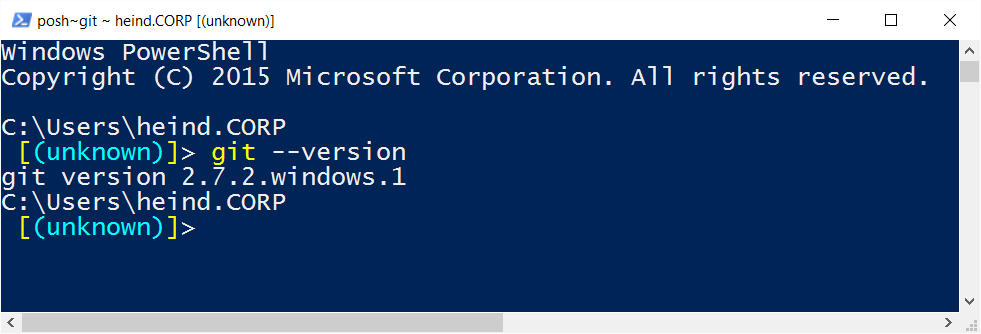

Looks good.
